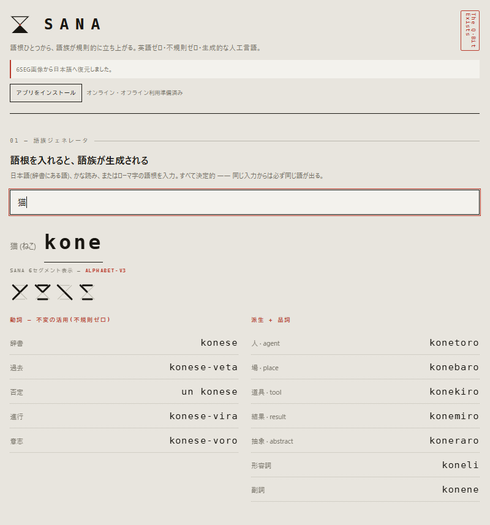

# SANA Language

**語根ひとつから、語族が規則的に立ち上がる。**  
英語ゼロ・不規則ゼロ・生成的な人工言語。



## Live Demo

https://6bddfbd9.sana-language.pages.dev

## About

SANA は、語根と公開された規則から語を生成する人工言語／翻訳実験です。
同じ入力からは常に同じ語が生成され、語根・派生・品詞・文法標識を分解して扱えることを重視しています。

v1.4.0-alpha.4 は約 51,850 語根を収録し、PWA としてホーム画面へのインストールとオフライン起動に対応しています。

## Features

- 語根から動詞活用・派生語・品詞を決定的に生成
- 日本語 → SANA 変換
- SANA → 日本語の再構成
- 6SEG alphabet-v3 表示・画像保存
- 6SEG画像の形状読取
- SANA / 日本語のコピー・テキスト保存
- 語根辞書の検索とユーザー語根追加
- PWA対応（インストール / Service Worker / オフライン起動）

## PWA

HTTPS で公開すると、対応ブラウザからホーム画面へインストールできます。
初回オンライン読み込み後は、アプリシェルが Service Worker にキャッシュされ、オフラインでも起動できます。

## Deploy to Cloudflare Pages

```bash
npx wrangler pages deploy . --project-name sana-language
```

デプロイ時は、このリポジトリの `index.html`、`manifest.webmanifest`、`sw.js`、`icons/` が同じルート階層にある状態で公開してください。

## Japanese lexical data / 日本語語彙データについて

SANA の日本語語彙処理の一部では、国立国語研究所が公開する
**『現代日本語書き言葉均衡コーパス』短単位語彙表 ver.1.0**
を参照して作成した加工語彙データを使用しています。

**出典**  
国立国語研究所  
『現代日本語書き言葉均衡コーパス』短単位語彙表 ver.1.0

**Original edited dataset copyright**  
National Institute for Japanese Language and Linguistics (NINJAL)  
国立国語研究所

SANA は、BCCWJ 語彙表そのもの、元データの頻度数値、頻度順位、ジャンル別頻度等を再配布しません。
SANA 内で使用・表示される語彙上の指標や分類がある場合、それらは開発者が独自に算出・設計したものであり、国立国語研究所による分類・評価・保証を示すものではありません。

本プロジェクトは現在、無料・広告なし・非営利で公開しています。
広告、有料機能、寄付・スポンサー収入、法人向け提供など営利性を伴う形へ変更する場合は、変更前に国立国語研究所へ確認する方針です。

元となるコーパスおよび語彙表には解析誤りが含まれる可能性があり、SANA の語彙情報についても完全な正確性を保証するものではありません。

### English note

Parts of SANA's Japanese lexical resources were created with reference to the **Balanced Corpus of Contemporary Written Japanese (BCCWJ) Short Unit Word Frequency List ver.1.0**, published by NINJAL.
SANA does not redistribute the original frequency list, raw frequency values, rankings, or register-specific frequency data. Any learning-oriented labels or classifications used by SANA are independently designed by the developer and are not evaluations or guarantees made by NINJAL.

## Version

`v1.4.0-alpha.4`

- BCCWJ reference / attribution notice added
- GitHub-ready PWA package
- 6SEG alphabet-v3

## Author

**Masato Nasu / 那須 雅人**
